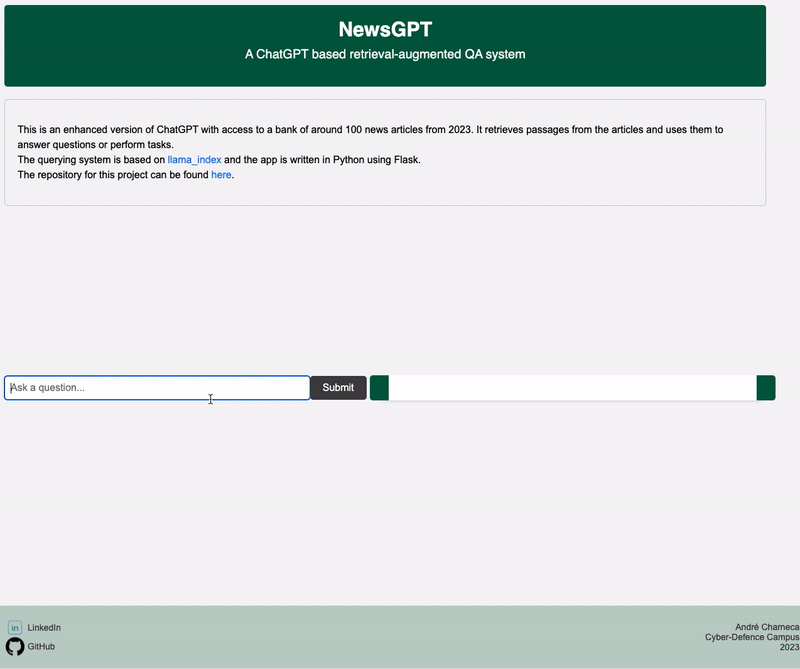

# News Articles QA System

The NewsGPT is an enhanced version of ChatGPT with access to a bank of news articles from 2023. It retrieves passages from the articles and uses them to answer questions or perform tasks.

## Getting Started

To get started with the NewsGPT, follow these steps:

1. Clone the repository: `git clone https://github.com/andrecharneca/news-articles-chatbot.git`
2. Enter the folder: `cd news-articles-chatbot`
3. Install the required dependencies: `pip install -r requirements.txt`
4. Setup your OpenAI API key: `conda env config vars set OPENAI_API_KEY=[key]`
5. Deactivate and activate the env, so the key takes effect.
6. Run the Flask app: `python app.py`
7. Open your web browser and navigate to `http://127.0.0.1:5000` to use the chatbot.

## Usage

1. Enter a question or query in the input box on the left side.
2. Click the "Submit" button.
3. The system will process the question and display the response on the right side.

## Resources Used

- Flask
- [Newspaper3k](https://newspaper.readthedocs.io/en/latest/) (for extracting news articles)
- [llama-index](https://github.com/jerryjliu/llama_index) (querying system)

## Practical Info
 - If after some time using it you come across an error in Chrome saying "You don't have authorisation to visit this page", close and reopen Chrome.
